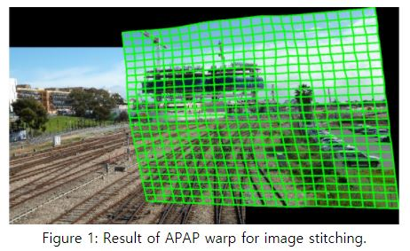
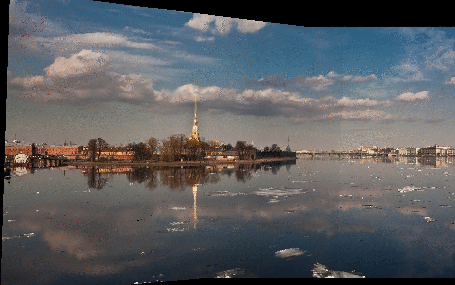
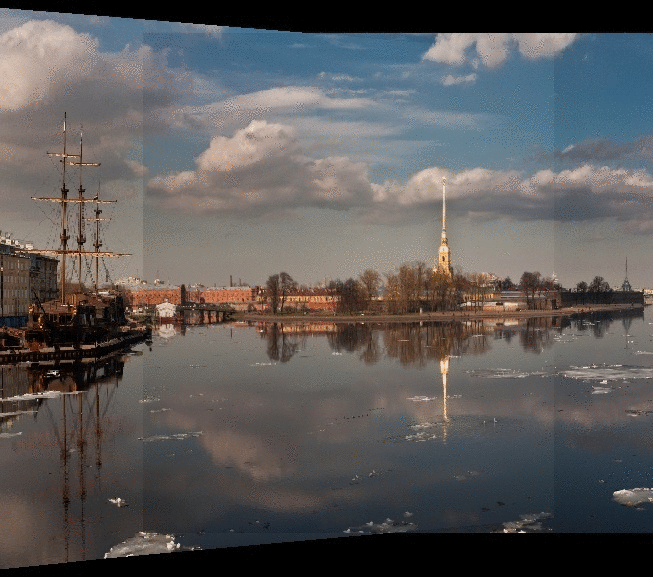

# As-Projective-As-Possible Image Stitching with Moving DLT

---

***2020.12.28. ~ 2021.01.03.***

Local-Homography warping

This program takes a list of images and performs stitching recursively.


This is a re-implementation with Python.


Official Matlab Code here: https://cs.adelaide.edu.au/~tjchin/apap/


## 1. Target Research Paper

The research paper: https://cs.adelaide.edu.au/~tjchin/apap/files/mdlt.pdf

**Zaragoza, Julio, et al. "As-projective-as-possible image stitching with moving DLT." *Proceedings of the IEEE conference on computer vision and pattern recognition*. 2013.**




## 2. Dependencies

```
python == 3.8.5

numpy == 1.19.2

opencv-python == 4.4.0.46

opencv-contrib-python == 4.4.0.46

pillow == 8.0.1

tqdm == 4.50.2

argparse
```

- Editor: PyCharm


## 3. Quick Start

### Windows User

- unzip demo_bat.zip.
- run demo.bat files on terminal.


### Linux User

- unzip demo_sh.zip.
- run demo.sh files on terminal.


You can give various types of options, check out "option.py". The "demo"s are tutorials.


## 4. Pipeline

1. Image Loading
2. Grayscaling & SIFT(OpenCV) 
3. Brute-Force Matching
4. RANSAC
5. Global-Homography Estimating & Final Size Extracting
6. Local-Homography Estimating
7. Superpixel Warping
8. Uniform Blending (50:50)


## 5. Why do stitching recursively?

- If stitching is performed sequentially from the left, the picture is excessively oriented to one side. In that case, it becomes difficult to estimate the correct homography.
- APAP doesn't consider <u>**perspective distortion**</u> of multiple image stitching.
- Recursive Stitching:




- Sequential Stitching:

  


- In addition, if the size of the input image is too small, it is difficult to extract feature points, so that an incorrect homography may be estimated.


## 6. References

### code

1. https://github.com/lxlscut/APAP_S
2. https://github.com/fredzzhang/Normalized-Eight-Point-Algorithm
3. https://cs.adelaide.edu.au/~tjchin/apap/#Source

### demo images

1. https://github.com/daeyun/Image-Stitching
2. https://github.com/opencv/opencv_extra
3. https://www.pyimagesearch.com/2018/12/17/image-stitching-with-opencv-and-python/


thanks.


## 7. Optimization

There is room for optimization in the local warping algorithm by using numpy library. (operation speed)


## 8. Author

Dae-Young Song

Undergraduate student, Department of Electronic Engineering, Chungnam National University

[Github][EadCat (Dae-Young Song) (github.com)](https://github.com/EadCat)


